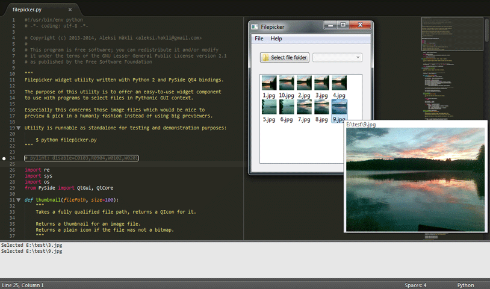

filepicker
===========

Esy-to-use widget for picking (image) files from a thumbnailed list.  

Easy to embed into existing GUI applications. Works as standalone.

Written with Python 2, PySide and Qt4+ bindings.

